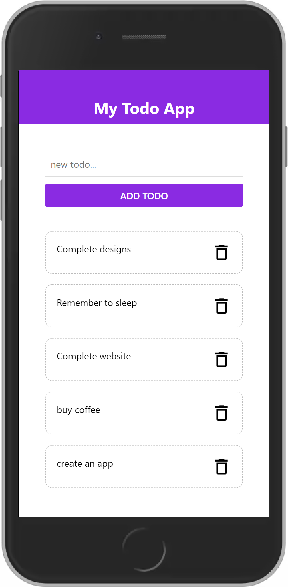

# Todo React Native

This is my first project on react native using expo cli. It is a simple todo list application which saves the notes until it maintains the state.

## Steps for installation
> Nodejs and npm should be installed in the system

<br>

### expo cli required to run the application
```
npm install -g expo-cli
```

### clone the repository and open terminal in it and type this command.
```
npm install --save
npm start
```

## Output

<br>


